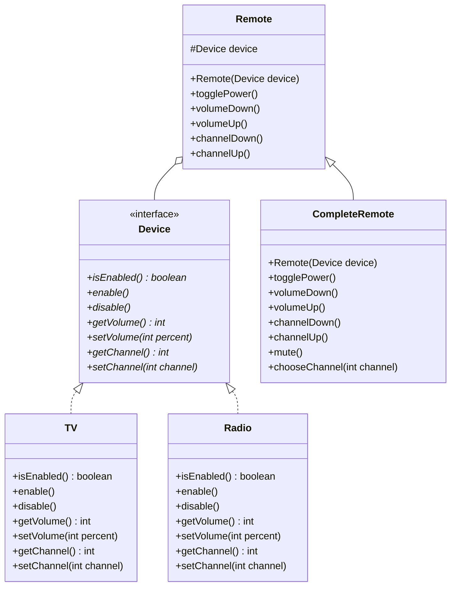

# Instructions

Now let's implement the Bridge Design Pattern



Here is the matching class diagram. Create the matching classes in the matching files.

Here is the description : 
* For `Device` implementations :
  * `isEnabled` should indicate if the device is on or off.
  * `enable` should turn on the device
  * `disable` should turn off the device
  * `getVolume` should return the volume of the device
  * `setVolume` should update the volume of the device
  * `getChannel` should return the channel of the device
  * `setChannel` should update the channel of the device
* For `Remote` :
  * `togglePower` should enable the device if the device is disabled, and disable it if it is enabled
  * `volumeDown` should substract 10 to the volume of the device
  * `volumeUp` should add 10 to the volume of the deviced
  * `channelDown` should substract 1 to the channel of the device
  * `channelUp` should add 10 to the volume of the device
* For `CompleteRemote` :
  * `mute` should update the volume of the device to 0
  * `chooseChannel` should update the channel of device to the channel in parameter

Override the `toString` method: 
* for TV : "TV{isEnabled=`isEnabled`, volume=`volume`, channel=`channel`}".
* for Radio : "Radio{isEnabled=`isEnabled`, volume=`volume`, channel=`channel`}".

# Usage

Here is a possible ExerciseRunner.java to test your function :

```java
public class ExerciseRunner {

  public static void main(String[] args)  {
    TV tv = new TV();
    CompleteRemote remoteTV = new CompleteRemote(tv);

    Radio radio = new Radio();
    Remote remoteRadio = new Remote(radio);

    remoteTV.chooseChannel(37);
    remoteTV.togglePower();
    remoteTV.volumeUp();
    remoteTV.volumeUp();

    remoteRadio.channelUp();
    remoteRadio.volumeUp();

    System.out.println(tv);
    System.out.println(radio);
  }
}
```
          
and its output :
```shell
$ javac *.java -d build
$ java -cp build ExerciseRunner 
TV{isEnabled=true, volume=20, channel=37}
Radio{isEnabled=false, volume=10, channel=1}
$
```

# Notions
[Class diagram](https://fr.wikipedia.org/wiki/Diagramme_de_classes)  

