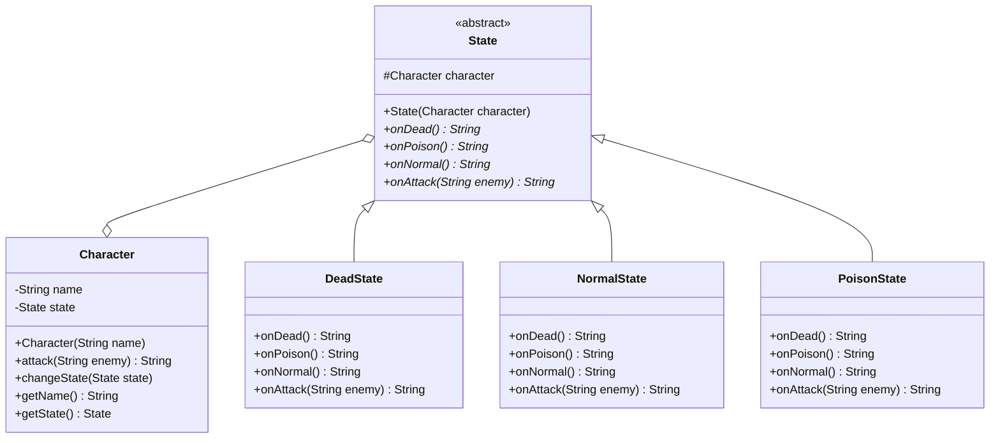

# Instructions

Now let's implement the Bridge Design Pattern



Here is the matching class diagram. Create the matching classes in the matching files.

Here is the description : 
* For `Character` :
  * `attack` should return the string "`character.name` attack `enemy`.".
  * `changeState` should update the `state` field with the one as parameter.
  * `getName` should return the name of the character.
  * `getState` should return the volume of the device.
* For `DeadState` :
  * `onDead` should return "The character is already dead.".
  * `onPoison` should return "The character can't be poisoned.".
  * `onNormal` should return "The character can't be resurrected.".
  * `onAttack` should return "Impossible, character is dead.".
* For `NormalState` :
  * `onDead` should return "Character is now dead.".
  * `onPoison` should return "Character is now poisoned.".
  * `onNormal` should return "Character is already alive.".
  * `onAttack` should return the result of `character.attack` method.
* For `PoisonState` :
  * `onDead` should return "Character is now dead.".
  * `onPoison` should return "Character is already poisoned.".
  * `onNormal` should return "Character is no more poisoned.".
  * `onAttack` should return the result of `character.attack` method concatenated with "`character.name` lost 10HP because he's poisoned.".

# Usage

Here is a possible ExerciseRunner.java to test your function :

```java
public class ExerciseRunner {

  public static void main(String[] args)  {
    Character boromir = new Character("Boromir");
    System.out.println(boromir.getState().onAttack("Uruk-hai"));
    System.out.println(boromir.getState().onPoison());
    System.out.println(boromir.getState().onAttack("Uruk-hai"));
    System.out.println(boromir.getState().onDead());
    System.out.println(boromir.getState().onAttack("Uruk-hai"));
  }
}
```
          
and its output :
```shell
$ javac *.java -d build
$ java -cp build ExerciseRunner 
Boromir attacks Uruk-hai.
Character is now poisoned.
Boromir attacks Uruk-hai. Boromir lost 10HP because he's poisoned.
Character is now dead.
Impossible, character is dead.
$
```

# Notions
[Class diagram](https://fr.wikipedia.org/wiki/Diagramme_de_classes)  

