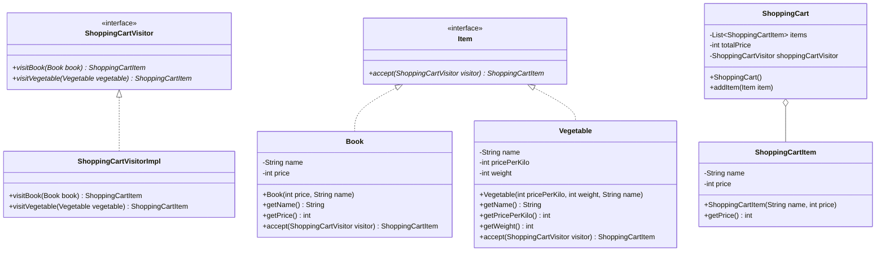

# Instructions

Now let's implement the Visitor Design Pattern



Here is the matching class diagram. Create the matching classes in the matching files.

Here is the description : 
* For `ShoppingCartVisitorImpl` :
  * `visitBook` should build a `ShoppingCartItem` using the book name and the book price.
  * `visitVegetable` should build a `ShoppingCartItem` using the vegetable name and the vegetable weight * vegetable price per kilo.
* For `Book` :
  * `accept` should return result of `visitBook` of the visitor in parameter.
  * the getters return the matching values.
* For `Vegetable` :
  * `accept` should return result of `visitVegetable` of the visitor in parameter.
  * the getters return the matching values.
* For `ShoppingCart` :
  * `addItem` should build a `ShoppingCartItem` using the visitor (you need to call the `accept` of the `Item` as parameter).
  * override to String as follows : "Item `name` for `price` €"
* For `ShoppingCartItem` :
  * override to String as follows : "You need to pay `totalPrice`€ for : `items`"

# Usage

Here is a possible ExerciseRunner.java to test your function :

```java
public class ExerciseRunner {

  public static void main(String[] args)  {
    ShoppingCart shoppingCart = new ShoppingCart();
    shoppingCart.addItem(new Book(32, "Game of Thrones"));
    shoppingCart.addItem(new Vegetable(10, 5, "Bean"));
    shoppingCart.addItem(new Vegetable(4, 10, "Tomato"));
    shoppingCart.addItem(new Book(12, "Les fleurs du mal"));

    System.out.println(shoppingCart);
  }
}
```
          
and its output :
```shell
$ javac *.java -d build
$ java -cp build ExerciseRunner 
You need to pay 134€ for : [Item Game of Thrones for 32 €, Item Bean for 50 €, Item Tomato for 40 €, Item Les fleurs du mal for 12 €]
$
```

# Notions
[Class diagram](https://fr.wikipedia.org/wiki/Diagramme_de_classes)  

