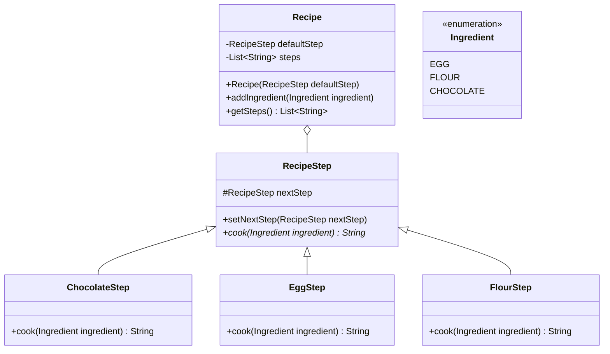

# Instructions

Now let's implement the Chain Of Responisibility Design Pattern



Here is the matching class diagram. Create the matching classes in the matching files.

Here is the description : 
* For `Recipe` :
  * `addIngredient` should call `defaultStep.cook` method and store the result in the steps list.
  * `getSteps` return the list of steps.
* For `RecipeStep` :
  * `setNextStep` should update the `nextStep` field with the attribute
* For `ChocolateStep` :
  * `cook`: if the ingredient is `CHOCOLATE`, the return "Chocolate is melted", else return the `nextStep.cook` result.
* For `EggStep` :
  * `cook`: if the ingredient is `EGG`, the return "Eggs are ready", else return the `nextStep.cook` result.
* For `FlourStep` :
  * `cook`: if the ingredient is `FLOUR`, the return "Flour is mixed", else return the `nextStep.cook` result.

# Usage

Here is a possible ExerciseRunner.java to test your function :

```java
public class ExerciseRunner {

  public static void main(String[] args) {
    ChocolateStep chocolateStep = new ChocolateStep();
    FlourStep flourStep = new FlourStep();
    EggStep eggStep = new EggStep();
    eggStep.setNextStep(flourStep);
    flourStep.setNextStep(chocolateStep);

    Recipe chocolateMousse = new Recipe(eggStep);
    chocolateMousse.addIngredient(Ingredient.EGG);
    chocolateMousse.addIngredient(Ingredient.CHOCOLATE);

    System.out.println(chocolateMousse.getSteps());
  }
}
```
          
and its output :
```shell
$ javac *.java -d build
$ java -cp build ExerciseRunner 
[Eggs are ready, Chocolate is melted]
$
```

# Notions
[Class diagram](https://fr.wikipedia.org/wiki/Diagramme_de_classes)  

