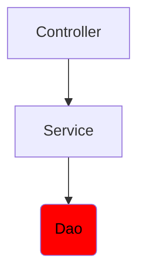

# Instructions

We will implement a little application using a 3 tier architecture.  
In this step, we will implement the DAO tier.



Create a class `NumberDao` in the matching file.  
It has a field `fileName` and a constructor with the field as parameter.  
It has a method `saveInt` which take an integer as parameter and write it in a file named `fileName`.

# Usage

Here is a possible ExerciseRunner.java to test your function :

```java
public class ExerciseRunner {

  public static void main(String[] args) {
      NumberDao numberDao = new NumberDao("number.db");
      numberDao.saveInt(13);
  }
}
```
          
and its output :
```shell
$ javac *.java -d build
$ java -cp build ExerciseRunner 

$ cat number.db
13
```

# Notions
[3-tiers architecture](https://fr.wikipedia.org/wiki/Architecture_trois_tiers)  

