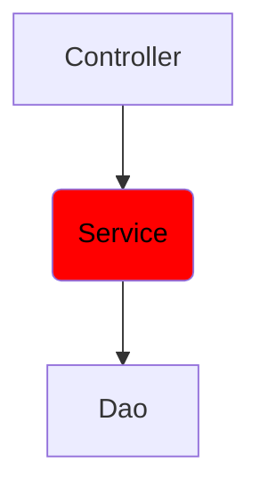

# Instructions

Let's continue our little application and keep your class from previous exercice.  
In this step, we will implement the Service tier.



Create a Record `IntOperation` in a matching file. It has 2 integer field : `number1` and `number2`.

Create a class `ComputeService` in the matching file.  
It has a field `numberDao` of type `NumberDao` and a constructor with the field as parameter.  
It has a method `add` which take an `IntOperation` as parameter and call the method `saveInt` of `NumberDao` with the sum of the two integers in of the parameter.

# Usage

Here is a possible ExerciseRunner.java to test your function :

```java
import java.io.IOException;

public class ExerciseRunner {
    public static void main(String[] args) throws IOException {
        NumberDao numberDao = new NumberDao("number.db");
        ComputeService computeService = new ComputeService(numberDao);
        computeService.add(new IntOperation(14, 5490));
    }
}
```
          
and its output :
```shell
$ javac *.java -d build
$ java -cp build ExerciseRunner 

$ cat number.db
5504
```

# Notions
[3-tiers architecture](https://fr.wikipedia.org/wiki/Architecture_trois_tiers)  
[Record](https://docs.oracle.com/en/java/javase/18/language/records.html)  

