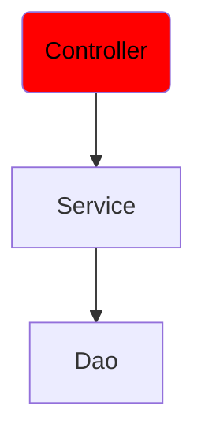

# Instructions

Let's continue our little application and keep your class from previous exercise.  
In this step, we will implement the Controller tier.

For this, retrieve the RestEngine and all related files from Quest 2, Exercise 10 : 
* `RestEngine`
* `Rest`
* `QueryParam`
* `Post`
* `Get`



Create a class `OperationDTO` in a matching file. It has 2 integer public field : `x` and `y`.

Create a class `ComputeController` in the matching file.  
It has a field `computeService` of type `ComputeService` and a constructor with the field as parameter.  
It has a method `add` which take an `OperationDTO` as parameter and call the method `add` of `ComputeService`. You should map the `OperationDTO` to the `IntOperation`. This method returns a String "OK".

# Usage

Here is a possible ExerciseRunner.java to test your function :

```java
import java.io.IOException;

public class ExerciseRunner {
    public static void main(String[] args) throws IOException {
        NumberDao numberDao = new NumberDao("number.db");
        ComputeService computeService = new ComputeService(numberDao);
        ComputeController computeController = new ComputeController(computeService);

        new RestEngine().startServer(8080, new Object[]{computeController});
    }
}
```
          
and its output :
```shell
$ javac *.java -d build
$ java -cp build ExerciseRunner 

$ curl -X POST "http://localhost:8080/api/compute/add" -d "x=12;y=43" 
OK
$ cat number.db
55
```

# Notions
[3-tiers architecture](https://fr.wikipedia.org/wiki/Architecture_trois_tiers)  
[Record](https://docs.oracle.com/en/java/javase/18/language/records.html)  

